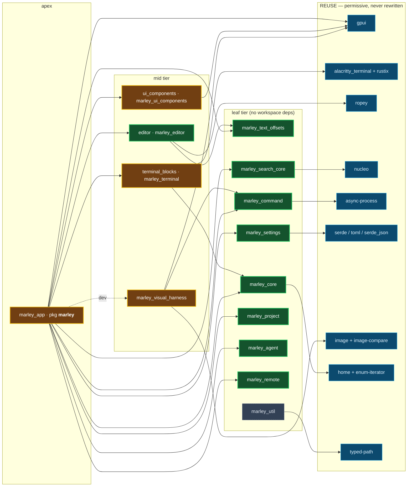

# Marley — Crate Map (the current inventory)

> The **current workspace inventory** as of **M15** ("The Editable Editor"): every crate that ships in
> `crates/`, its package name, purpose, key dependencies, the **pure-vs-shim** seam, and the real
> dependency structure. The Marley-centric companion to [crate-triage.md](crate-triage.md) (the M15
> health report + the original 77-Warp-crate triage) — this doc says *what each crate is*; the triage
> says *how healthy it is* and *what Warp verdict it descends from*.
>
> **15 crates, all BUILT** at this M15 snapshot — one of them, `marley_forge_client`, was **deleted** at #411
> (the 2026-08-09 scrap-forge product rip; the completed-pipeline archive keeps
> its history). Lineage ≠ copying: the REIMPLEMENT crates are written **from our spec docs**,
> never the AGPL Warp source (clean-room §20). Where a crate rebuilds Warp behavior, the Warp crate it
> descends from is named; the INVENT crates (project/agent/remote) have no Warp lineage — they are
> net-new Ignibyte value.

## Legend

| Mark | Meaning |
|---|---|
| ✅ **BUILT** | shipped at the full gate |
| 🟢 **PURE** | no OS/gpui/IO surface — 100% unit + mutation tested (cov/MSI 100), the pipeline's pure-seam standard |
| 🟡 **SHIM-BEARING** | a pure decision core **plus** a masked, ACCEPTED-UNTESTABLE boundary (gpui render / raw PTY / raw socket / display+subprocess), `#[mutants::skip]` + coverage-excluded, asserted by the headed harness |
| **REIMPLEMENT** | Warp behavior rebuilt fresh from spec |
| **REUSE** | a permissive third-party crate integrated, never rewritten |
| **INVENT** | net-new Ignibyte layer — no Warp lineage |

## The dependency graph

The M15 workspace crates (minus `marley_forge_client`, deleted at #411) and their **real** inter-crate edges (from `crates/*/Cargo.toml`), plus the
permissive REUSE leaves each pulls. `marley_app` (the apex) depends on **every** other crate except the
still-orphan `marley_util`; the harness is a `dev-dependency` of the app.

## The inventory (every crate)

Sorted leaf → apex. **Dir** = the `crates/` folder; **Package** = the Cargo `name` (several differ from
the folder). LoC is `src/**/*.rs`. "Ref" links the per-crate architecture doc.

| Dir | Package | LoC | Purpose | Key deps | Seam | Warp lineage | Ref |
|---|---|---:|---|---|---|---|---|
| `marley_text_offsets` | `marley_text_offsets` | 448 | Sole owner of the `CharOffset`/`ByteOffset` newtypes + the streaming `CharCounter` (byte→char). Kills the byte-vs-char index bug workspace-wide. | serde, get-size2 | 🟢 PURE | `string-offset` (REIMPLEMENT S) | [editor.md](editor.md) §seam-1 |
| `marley_util` | `marley_util` | 415 | Value-type vocabulary: `FileId`, `ContentVersion`, `HostId`, `StandardizedPath`, `LocalOrRemotePath`, `standardize_path`. **Built ahead of a consumer — currently orphan** (no other crate depends on it yet). | serde, typed-path | 🟢 PURE | `warp_util` (value-type subset, REIMPLEMENT M) | [marley_util.md](marley_util.md) |
| `marley_core` | `marley_core` | 583 | The offline-boot runtime core: `SessionId`, the `~/.marley` path layout, the single-channel `Config`, and the `FeatureFlag` registry. No network/cloud/auth. | home, enum-iterator, once_cell, serde | 🟢 PURE | `warp_core` (non-cloud) + `warp_channel_config` + `warp_features` (INVENT/REIMPLEMENT) | [marley_core.md](marley_core.md) |
| `marley_command` | `marley_command` | 559 | The workspace's single **non-PTY** child-process spawn seam (`blocking` + `r#async`); the escape hatch for the `disallowed-types` ban on `std::process::Command`. Unix-only (Windows → 004b). | async-process | 🟢 PURE (real-subprocess integration tests, no shim) | `command` (REIMPLEMENT S) | [marley_command.md](marley_command.md) |
| `marley_search_core` | `marley_search_core` | 109 | The shared fuzzy engine: `fuzzy_score` (one candidate) + `fuzzy_rank` (a list), wrapping nucleo. One matcher for the palette + file-open. | nucleo | 🟢 PURE | `warp_search_core` (the fuzzy slice, REIMPLEMENT L) | [marley_search_core.md](marley_search_core.md) |
| `marley_project` | `marley_project` | 730 | The project model: `Project::discover_in` walks up for the nearest `.git`; the context for file listing/search/docks. gpui-free. **M21 #326** adds the PURE `search::search_lines` project-search engine (literal substring, case + whole-word toggles, CHAR-offset cols, the per-file cap — gpui-free + tool-shaped for a future `workspace.search` MCP read-tier) + `walk_text_files`, a masked LAZY-iterator shim over ripgrep's **`ignore`** crate (gitignore-aware, belt-filtered by `should_skip`). `ignore`'s whole transitive closure was already in-lock, so it was the crate's first real dependency. | `ignore` (+ std) | 🟢 PURE (+ masked walk shim) | INVENT (`repo_metadata` lineage) | [marley_project.md](marley_project.md) |
| `marley_agent` | `marley_agent` | 182 | The agent-run model: `agent_kind_of` (recognize a CLI), `agent_status_from`, `AgentRun`. The pure model behind the agent cockpit; launch/observe live in the app shim. | (std only) | 🟢 PURE | INVENT (`ai` action-model lineage) | [marley_agent.md](marley_agent.md) |
| `marley_remote` | `marley_remote` | 348 | The remote **ssh** seam: parse `[user@]host[:port]` → a safe `ssh` argv (`Vec<String>`, `--` guard, leading-dash reject). Holds **no** secrets; `ssh` owns all auth. | serde | 🟢 PURE | INVENT (remote-connection seam; replaces `remote_server` SKIP) | [marley_remote.md](marley_remote.md) |
| `marley_settings` | `marley_settings` | 512 | The typed declarative **TOML settings** framework: declare a `Setting`, get file persistence + defaults + lazy resolution + reload + change events via `SettingsManager`. Local-only, non-syncable. | serde, toml | 🟢 PURE | `settings` + `settings_value` + `settings_value_derive` (REIMPLEMENT M) | [settings.md](settings.md) |
| `editor` | `marley_editor` | 1349 | The UI-agnostic **rope-backed editable text core**: `Buffer` (ropey), `Selection`/`SelectionSet`, `movement` (char/word/line/vertical), and **undo/redo with coalesced typing**. Grew from the M1.A prompt buffer into the full M15 editable editor. gpui-free, IO-free (its deps: `ropey`, `marley_text_offsets`, and **M22 #339** `regex` — pure computation, so the gpui-free/IO-free identity holds; already in-lock via gpui + tree-sitter, so no new audit surface). **M22 #339** (regex find) adds to `find.rs`: `find_all_regex(text, pattern, case_insensitive) -> Result<Vec<(CharOffset, CharOffset)>, FindError>` — the find bar's regex mode, a PEER to the literal `find_all` (⌘D/⌘⇧L never reach it). The byte→char conversion is ONE monotone `char_indices` cursor (`regex` reports bytes; the editor counts chars) — O(n+m), no per-match rope walk, no fallible lookup, `debug_assert`-guarded on the ascending-boundary invariant (the loud failure the rejected HashMap draft had). Full-Unicode `(?i)`, deliberately diverging from `find_all`'s ASCII fold (Fork B). `find_iter` OWNS the empty-match advance (D-EMPTY-ADVANCE dissolved). Plus `escape_literal` (wraps `regex::escape` so `regex` stays in-crate) and `FindError{InvalidPattern,TooComplex}` (mirrors `regex::Error`'s two shapes; a VALUE the bar renders inline). Capture-group REPLACE split to #347. **M22 #338** (auto-close) adds the pure `auto_close.rs` — `pair_action(typed, prev, next, has_selection) -> Action{InsertPair(char), TypeOver, Wrap(char), Insert}` (the closer RIDES the variant so the "not an opener" arm is unrepresentable rather than an uncovered cold arm) + `typed_char`/`is_pair`/`closer_of`; `selection.rs` gains `CaretSpan` and `selections_after_multi_edit`'s optional per-cursor post-state (**`None`/`&[]` = the identity = the pre-#338 math, property-pinned** — this fn is on the app's ONE insert path); `buffer.rs` gains `insert_pairing_at_selections` (per-cursor action resolution; a sweep where no cursor writes is a pure `set_selection`, since type-over is a caret MOVE and must not record undo or mark the file dirty), `backspace_pairing_at_selections` (a forward-widened consuming range), and `neighbours_at` (the single door buffer knowledge enters the decision through). **The undo tag is now EARNED**: `begin_group(restore, ends_at_insert)` and the ungrouped fast path gated on `ends_at_insert && restore == set` — `coalesces_into` and both history fallbacks TRUST invariants they never check, and a caret span is the first thing able to falsify them (a hardcoded `true` made redo replay `()x` where the text read `(x)`). **M19 #300** (move/duplicate lines) adds `line_move.rs` — `move_lines(buffer, set, dir) -> Option<(Vec<LineEdit>, SelectionSet)>` + `duplicate_lines(...)`: the line-REORDER seam beside `indent`'s line-EDIT seam, returning the edits AND the CARRIED cursor set (D-CARRY-NOT-REBASE; the carry is CHAR arithmetic; endpoints attributed by OFFSET SPAN so a full-line selection's carved boundary head isn't dropped). **M19 #303** (destructive ops) adds `delete.rs` — `DeleteOp` + `delete_range_for(op, buffer, sel) -> Option<Range<CharOffset>>` + `delete_edits(...) -> Option<(Vec<LineEdit>, carried SelectionSet)>`: the delete-RANGE seam beside `line_move`'s reorder seam and `indent`'s edit seam. The range IS the motion (`move_word_left/right` + line bounds — D-MOTION-IS-THE-RANGE); a delete REUSES `rebase_selections`' clamp (D-REBASE-IS-CORRECT-HERE — the exact clamp #300 banned for a move, correct for a delete because the op removes the caret's own span); overlapping/adjacent ranges merge. Plus `buffer.rs` gains `delete_forward_at_selections` (plain ⌦). | ropey, marley_text_offsets | 🟢 PURE | `warp_editor` (REIMPLEMENT L) | [editor.md](editor.md) |
| `syntax` | `marley_syntax` | 560 | **Semantic highlighting** (M16 #268; **multi-language M20 #315**): tree-sitter parses the file's language — a `Lang` axis (`lang.rs`) selecting the grammar + its OWN adopted `HIGHLIGHT(S)_QUERY` for Rust/Python/JavaScript/TypeScript/TSX/JSON/Bash — and the captures map onto the **10-kind palette** (grown 5→10: +Function/Type/Attribute/Punctuation/Property) via the language-agnostic `kind_of_capture` (tree-sitter's shared base-name convention + one JSON-key override, `string.special.key`→Property); `sweep_disjoint` + `clip_to_lines` yield per-line ascending-disjoint raw-byte spans. TS/TSX CONCATENATE the JS base query ahead of the `inherits: ecma`/`jsx` overlay (the overlay alone renders blank); TOML + no-grammar files (Markdown/Plain) fall to `code_syntax`'s hand-lexer floor. The off-thread `#274` worker rebuilds its session when the file's language changes (a switch is a new file identity → full re-parse anyway). Safe Rust (the FFI lives in the deps); `parse.rs` is the documented FFI-adjacent shim exclude. **M21 #329** adds the crate's FIRST node-range API — `enclosing_ranges(&HighlightSession, byte_range) -> Vec<Range<usize>>` (the ancestry ladder: smallest named node → root, byte ranges, adjacent-dedupe; reads the previously-fully-encapsulated held `tree`; a plain Node walk that stays in `lib.rs` at cov/MSI 100, no `is_named` filter since anonymous nodes are always leaves). It is the shared foundation the #305 fold + #330 sticky-header reuse; the app's `selection_ladder.rs` (`SelectionLadder` grow/shrink-to-anchor) + the ⌃W/⌃⇧W chords project it to the editor selection. **M21 #330** (the foundation's first consumer) adds `all_headers(&HighlightSession) -> Vec<Range<usize>>` — every header-bearing node (the `Node::kind()` table: function/impl/mod/trait_item) in document order, via an ITERATIVE `TreeCursor` walk (recursion would recurse the FULL tree depth and overflow the UI stack on a deep file — a 2000-level regression test pins it); the app's `sticky_header.rs` (`sticky_rows` — the pure pin decision) + a per-(nonce,version) span cache + the `editor.sticky_header` setting project it to the pinned overlay band. **M22 #340** adds the THIRD node API — `matching_delimiters_in(src, byte_pos) -> Option<(Range<usize>, Range<usize>)>` — the bracket-match truth source, and the first that PARSES `src` itself (parse-only, no `&HighlightSession`; the app holds no cached tree). ADJACENT-only (`descendant_for_byte_range(pos,pos)` must land ON a delimiter token; a caret in open code → None, not the enclosing pair), before-then-at probe, `is_missing()` rejects an error-recovery phantom `)`, `set_language().ok()?`/`checked_sub()?` keep it total with no dead line. The app's `bracket_match` field + `go_to_matching_bracket` (⌘⇧\) + the `MarkTier::Bracket` render (lowest tier, `raw_span_to_display_bytes`) project it to the editor; the cached-tree variant is #349. **M19 #304** adds the FOURTH node API — `symbols.rs`: `file_symbols(src) -> Vec<Symbol>` + `Symbol{name,kind,line,col}` + `SymbolKind`, the ⌘⇧O "Go to Symbol in File" extractor. It ADAPTS the grammar's OWN `tags.scm` (a query RUN, not a hand-walk — `parse.rs` gains `tags_query()`, the OnceLock twin of `highlight_query()` compiling `TAGS_QUERY`): map `@definition.*` → SymbolKind (splitting the conflated `@definition.class` by `node.kind()`), dedup the method/function double-match preferring Method, char-correct 1-based (line,col), `@reference.*` dropped. Pure/LSP-agnostic (the app's `editor_symbols::file_symbol_glyph` maps the kind); the CALLER gates on Rust (D-CALLER-GATES-LANGUAGE, the #340 shape; #329/#330 violate it = #351). The `.into_iter()`-over-Option idiom keeps the parse line-total with no dead region + no for_loops_over_fallibles lint. **M19 #305** adds the FIFTH node API — `fold.rs` (a NEW module, not `lib.rs`): the pure code-fold engine. `fold_regions(src) -> Vec<FoldRegion{header_row,end_row}>` (the multi-line FOLD_KINDS = function/impl/mod/trait/struct/enum_item + `match_expression`, via the `all_headers` ITERATIVE `TreeCursor` walk, the `.into_iter()`-over-Option parse) + `FoldProjection` — THE first buffer-row↔visible-row projection: `new(total, &[(header,end)])` merges the active folds into sorted HALF-OPEN `[start,end)` hidden runs, `visible_count`/`buffer_row(slot)`/`slot_of(row)` (a hidden row → its header's slot) a prefix-sum bijection, total (out-of-range saturates). The half-open storage is deliberate — it puts `slot_of`'s upper boundary on the first VISIBLE row after a fold (where snap-vs-count differ), so an inclusive-form EQUIVALENT mutant can't survive → cov/MSI 100. The app-side `app.rs` projects it at the `uniform_list` rim ONCE (the ~17 interior sites stay buffer-row), anchor-keys the fold state, and reveals on jump (`reveal_and_scroll_to_row`); the caller gates Rust (D-CALLER-GATES-LANGUAGE). | tree-sitter, tree-sitter-rust | 🟡 SHIM (pure map/sweep/clip + node-range API + masked `parse.rs`) | tree-sitter adoption (the syntax subsystem reference) | [editor.md](editor.md) |
| `marley_lsp` | `marley_lsp` | ~3300 | **The M20 LSP wire + doc sync + diagnostics + hover** (#308/#309/#310/#311): a deliberately DUMB transport that spawns a language server (rust-analyzer v1) and moves `Content-Length`-framed JSON-RPC over stdio. Pure seams — the frame decoder, the JSON-RPC route + pending-request table (timeout + cancel), the spawn→initialize→ready→crashed lifecycle (capped 3/60s restart), the `initialize` handshake (+ `file_uri` and its `path_from_file_uri` inverse), config/resolve, the `textDocument` sync notification builders, the (#309) encoding-aware **position bridge** (buffer `char` offset ↔ LSP (line, UTF-16/8/32 column), pure over `&str`), and the (#310) **diagnostics model** (a per-PATH `publishDiagnostics` store [REPLACE/CLEAR], the row union with the M18 terminal lane, per-row underline spans, the status counts — the ONE `lsp-types` consumer is the publish parser; **#327** adds `DiagnosticStore::iter`/`total_len` enumeration + the workspace `problem_rows` aggregator [`ProblemRow`, sort `(severity, path, line)` via the `Severity` `Ord`, cap + tail, a wired-but-empty terminal producer] the ⌘⇧M problems panel lists across every host — tool-shaped for a future `workspace.problems` MCP tier), the (#311) **hover payload** (`hover_request_params`, `parse_hover_result` for the 3 `Hover.contents` shapes, and the `markdown_runs` markdown-lite block split the overlay card renders), and the (#312) **definition payload** (`parse_definition_result` normalizing the 3 shapes `Location` \| `Location[]` \| `LocationLink[]` — the last preferring `targetSelectionRange` over `targetRange` so the caret lands on the identifier, not the doc comment — into a flat `Vec<DefLocation>`, skipping any malformed element so a bad payload degrades to "no targets", never a wrong jump or a panic), and the (#313) **completion payload** (`parse_completion_result` for BOTH shapes — `CompletionList{isIncomplete,items}` and a bare `CompletionItem[]` — normalizing the FOUR insert forms [`textEdit` / `InsertReplaceEdit` preferring `replace`, the range covering what was typed / `insertText` / label-only] into one `CompletionEdit`, per-item `filter_map` so one bad entry cannot lose the list, and an INVERTED range rejected at the seam because `Buffer::edit(start..end)` panics ropey on it; plus `strip_snippet_markers` [depth-tracked, so a nested `${1:${2:x}}` cannot leak raw snippet syntax into the buffer], `completion_request_params` adding the `context{triggerKind,triggerCharacter}` the base position shape lacks, and `trigger_characters` off the raw caps #308 kept), and the (#322) **WorkspaceEdit engine** (`workspace_edit.rs` — the ONE apply path rename/#323 code-actions/#314 organize-imports converge on: `parse_workspace_edit` for BOTH `changes`/`documentChanges` shapes [resource-op → reject-whole v1, malformed-element skip, `2^32`-position skip-not-truncate], `resolve_text_edits` mapping LSP ranges→char offsets via the #309 bridge then sorting last-to-first + rejecting overlap/inverted [adjacency survives], `apply_text_edits` splice, `rename_support`/`parse_prepare_rename`; `resolve_text_edits` is the shared primitive #314/#323 reuse), and the (#323) **code-action payload** (`code_action.rs` — `parse_code_actions` discriminating a usable `CodeAction` [an eager `edit` OR a non-null `data` blob to resolve] from a skipped-and-counted bare `Command` / a dropped `disabled`/malformed element, ordered quickfix-first + `isPreferred`-pinned; `needs_resolve`/`resolved_edit` for the deferred-edit round trip; `code_action_params` + `diagnostic_to_lsp` building the range + the caret-row `context.diagnostics`; `code_action_support` off the caps — the APPLY reuses the #322 engine unchanged, and the `initialize` handshake now advertises `textDocument.codeAction` so a real server actually returns the literals), and the (#324) **signature-help payload** (`signature_help.rs` — `parse_signature_help` normalizing a `SignatureHelp` [active indices reset-to-0 on OOB per LSP 3.17, a per-signature `activeParameter` override, a parameter label as a string OR `[start,end]` UTF-16 offsets → a highlight range, inverted/OOB dropped]; `should_request_signature` the pure trigger-vs-retrigger decision; `signature_help_params`/`signature_trigger_characters`/`signature_help_support`; the handshake advertises `textDocument.signatureHelp` [labelOffsetSupport + activeParameterSupport] to UPGRADE the reply), and the (#325) **workspace-symbol payload** (`workspace_symbol.rs` — `parse_workspace_symbols` normalizing BOTH `SymbolInformation` and `WorkspaceSymbol` [a deferred `location.range` → line 0 v1, `workspaceSymbol/resolve` a follow-up] via `path_from_file_uri` + a per-element `filter_map` [malformed → shorter list, never a panic]; `workspace_symbol_params` [just the fuzzy query the server ranks]; `workspace_symbol_support` — the server serves it without the cap, so the handshake's `workspace.symbol.symbolKind` UPGRADES the kind set rather than enabling it), and the (#331) **inlay-hint payload** (`inlay.rs` — `parse_inlay_hints` normalizing BOTH label shapes [a bare string and `InlayHintLabelPart[]`, parts CONCATENATED v1 — per-part locations/tooltips a named cut], carrying kind [1=Type/2=Parameter; an UNKNOWN kind still renders, since kind only classifies] + the padding flags, with a per-element `filter_map` so one bad hint cannot lose the line's others and `u32::try_from` never `as u32` [#312's lesson: a cast truncates a `2^32` line to line 0 = a confidently-wrong hint position]; `label_text` rejecting an empty label on BOTH shapes [an empty phantom is invisible but still takes a row slot and a sort key]; `inlay_hint_params` [its OWN range shape, not the shared position base — hints are a property of a REGION]; `inlay_hint_support`, WIRED to gate the send because an error reply writes no cache, so an ungated ask loops every round-trip forever — the handshake advertises `textDocument.inlayHint` AND `workspace.inlayHint.refreshSupport`, the latter being what makes a server send the refresh at all, and `rpc::reply_for_server_request` answers `workspace/inlayHint/refresh` with `AckNull` [the pure method→policy map; the re-fetch it asks for is the host's job]) + the shared `rpc::text_document_position_params` every position request fills (hover delegates to it; #312/#313/#322/#317 reuse it) — over a thin process shim. The app-side `lsp_host.rs` adds the GENERAL request→response→consumer path (#311: a purpose-tagged `request()` + a drained `responses` queue + the non-init response arm) that #312 goto (its second consumer) and #313/#317 reuse. Still knows nothing of `editor::Buffer` (the app reconciles). **Doc-sync is race-proof by CONSTRUCTION (M20 #320; ordering-dependent #312→#320):** `reconcile(&[(&Path, &dyn DocText)])` is the ONE Ready-gated read on the sync path — it decides AND materializes, reading version + text from the live buffer object (`DocText`, impl'd by `marley_editor::Buffer` app-side) inside the branches that send; `needs_text` is DELETED, so no pre-collected projection exists for a differently-gated read to disagree with. Reorder the pump's drain/collect/ensure/reconcile freely: worst case is a one-tick (16 ms) sync delay, never a wrong payload — the `BF-lsp-didopen-carries-empty-text-ready-race-001` class is unrepresentable. The app-level live-wire lane ships with it: `didopen_payload_carries_real_text_against_fake_ls_headless` spawns the REAL `fake_ls` through the app's own server config, reaches Ready via a real `drain()`, and asserts the captured outbound didOpen PAYLOAD byte-equal to the buffer (the host gains a `#[cfg(test)]` sent-bodies capture; the pump's open set derives from `ContentRegistry::editors_under`, the ONE root-filter the ensure + reconcile passes share). **M20 #321** completes the "derive from state, not from the event" shape: host CREATION (not just sync) now runs on the pump from the same open-document set, via `RootView::ensure_lsp_host_for_open_docs` between the collect and the reconcile — so a #205-restored editor tab, which never fires an open gesture, gets its server too (the old `ensure_lsp_for_opened_file`/`open_file_in_viewer` gesture trigger is deleted). The spawn gate is unchanged (`.rs`·under-root·no-host·`Cargo.toml`) but reordered cheapest-first for the per-tick path (`contains_key` → path scan → the manifest `stat` LAST, kept per-tick so a later `cargo init` is picked up); an existing host — including one whose binary was unresolvable — latches `contains_key` forever, so a mid-session install does not retry. It joins the SAME Ready-gate invariant: `LspHost::new` can never return a Ready host, so a host created mid-tick sends nothing that tick (`PR-claude-read-to-the-end-of-the-constructor-before-asserting-post-state-001` — the struct literal's `life: None` is NOT the constructor's post-state; `new` drives it to `Initializing` before returning). (The #312-era "do not introduce a `drain()` between the ensure and the reconcile" warning is RETIRED — #320 dissolved the ordering invariant.) and the (#314) **formatting payload** (`formatting.rs` — `formatting_support` [`documentFormattingProvider` object-or-true, the inlay-hint twin], `formatting_request_params` [honest `tabSize`/`insertSpaces`], `parse_formatting_edits` [the bare `TextEdit[] | null`, reusing `workspace_edit::text_edit_of` — no duplicate parse]; the APPLY is the shipped #322 `apply_one_file` engine, so this is only wire shapes; the `FormattingKey` stale guard lives app-side, since a version needs `editor::Buffer`), and the (#317) **references payload** (`references.rs` — `parse_references` for the `Location[] | null` result carrying the match's column SPAN [`start_col..end_col`, unlike a definition's start-only point; `end_col` collapses to `start_col` for a multi-line range and is CLAMPED `>= start_col` so a malformed server span can't underflow a downstream slice], `references_request_params` [the shared position base + `context.includeDeclaration:true`, the honest "who uses this?"], `references_support` off `referencesProvider` — the grouping + picker are app-side in `editor_references.rs`). Clean-room from the published LSP 3.17 spec. | marley_command, serde, serde_json, lsp-types | 🟡 SHIM (pure framing/rpc/lifecycle/handshake/config/position/docsync/diagnostics/workspace-edit/code-action/signature-help/workspace-symbol + masked `process.rs`; `fake_ls` fixture bin) | Zed `lsp` (published-spec REIMPLEMENT; §20 clean-room) | [editor.md](editor.md) |
| `terminal_blocks` | `marley_terminal` | 3793 | The UI-agnostic **PTY shell session + per-command `Block` model**: spawns a PTY, segments output into Blocks by DCS shell-integration metadata (cwd/branch/exit), emits a `BlockList` + styled runs (incl. OSC 8 links). | alacritty_terminal, rustix, marley_core | 🟡 SHIM (pure block/apply/styled core + masked `pty_os`, 9 skips; unmasked in the fork, #443) | `warp_terminal` (REIMPLEMENT M) | [terminal_blocks.md](terminal_blocks.md) |
| `ui_components` | `marley_ui_components` | 1500 | The theming value vocabulary (`Appearance`, `ThemeColors` — the lowest gpui-dependent crate) + the widget set (button/switch/dialog/tooltip/keyboard-shortcut chip) + the WCAG helpers (`relative_luminance`/`contrast_ratio`). **M20 #316:** a `SyntaxPalette` (one `Hsla` per the 9 `SyntaxSlot` syntax roles, `color_for`) FIELD on `ThemeColors`, tuned per built-in theme + a derived-default generator — **contrast-proven ≥AA by test** (each slot vs its background) AND pairwise-distinct (a contrast test is blind to two slots being the same color); the app's `token_color` resolves syntax colors through it, retiring the hardcoded literals. A leaf crate (gpui only), so `SyntaxSlot` is its own vocabulary, not the app/syntax `TokenKind`. | gpui | 🟡 SHIM (pure decision accessors + gpui `render` module, 9 skips; gallery bin) | `ui_components` (REIMPLEMENT M) | [ui_components.md](ui_components.md) |
| `marley_visual_harness` | `marley_visual_harness` | 3558 | **Gate-15 tooling**: launch the app headed, assert the macOS AXUIElement tree (via osascript, no FFI), diff screenshots against baselines. The normative target for every `visual_acceptance` clause. | gpui, image, image-compare, marley_command | 🟡 SHIM (pure geometry/diff/ax-parse surface + display/subprocess shim, 14 skips; selftest bin) | Marley-original (Warp analog `integration`, SKIP) | [marley_visual_harness.md](marley_visual_harness.md) |
| `marley_app` | **`marley`** (lib `marley_app`) | 22014 | The **apex app shell**: `run()` boots one gpui window; `RootView` renders the 3-region cockpit (left dock \| multi-pane terminal + editor center \| right dock) with the command palette, chord keymap, workspace/pane-group algebra, editor surface, code view, docks, and the agent panes. Depends on every other crate but `marley_util`. **M15 #259** (editable split pane — "the editor stops being a singleton") makes `PaneContent::CodeView` carry an editable `EditorSurface` (was a lossy read-only `CodeViewState`; the #237 recast pattern — `PaneState::code_view()` reads through `surface.active_file()` so the render + the #258 codec are unchanged) + the pure workspace seams `PaneGrid::focused_editable_surface()/_mut()` + `focused_pane_is_editable()` (the `focused_terminal` twins, cov/MSI 100); the app's `active_editor()/_mut()` + `Tab::key_context()` + the single `editor_geom`/IME slot became FOCUS-AWARE (resolving the focused pane, return types unchanged → ~75 sites untouched, the ~43 inline bypassers moved on, grep-gated), so a focused split code pane types/saves/selects like the editor tab; same file in tab+pane = two independent Buffers (D-OWN-BUFFER-V1, the #275 conflict net). **M20 #317** (find references, ⇧F12) adds the pure `editor_references.rs` — `group_references` (dedupe exact quadruples · current-file-first sort with a start_col tiebreak · honest ~200 cap · a `Header` per file's contiguous run · the `N references in M files` line; a non-`file:` uri groups under its raw uri) + `OpenReferences` (the grouped picker: header/reference rows, nav over the references only, LOCAL fuzzy filter in row order) + `ReferencesKey`, all cov/MSI 100 and IO-free; the app shim (`find_references`/`apply_references_response`/`fetch_reference_texts` [an OPEN buffer's row is LIVE, a cold file is one disk read, unreadable→path-only]/`jump_to_selected_reference`) reuses the #312 stale-guard + jump/NavStack, and `LspHost::has_pending_references()` gates the "Finding references…" card off the pending-request table so a timed-out request cannot strand the occluding overlay (the #331 `has_pending_inlay` lesson). **M21 #328** (git gutter) adds to the pure `git_diff.rs`: `GitMark`, `parse_hunk_new_start`, `flush_segment`, and `gutter_marks_from_hunks(&FileDiff) -> Vec<(row, GitMark)>` — a projection over the shipped `parse_diff` (route A, zero new deps) classifying added/modified/deleted segments against the NEW-side row counter; the app shim carries a DECOUPLED per-path `git_marks` store (a read-only `git diff HEAD` argv spawn reusing the `git_working_diff_in` posture, cache-keyed on `(path, git_marks_gen)` with the gen bumped on save/reload/in-app-commit) feeding a second gutter lane (a 3px Added→success/Modified→accent/Deleted→danger bar coexisting with the #289/#310 diagnostic tint). **M21 #331** (inlay hints) extends `code_view.rs`'s buffer→display seam to phantom text: `line_layout_with_inlays(line, tab_width, &[Inlay{char_idx,text}])` emits a phantom into `display` and consumes columns while pushing NO `col_starts` entry (`line_layout` becomes its empty-slice wrapper, a property test pinning them byte-identical so hints OFF is provably the pre-ticket path), and `LineLayout` gains `hint_spans` (the phantoms' display bytes, fed back as `TokenKind::Hint` → muted — REQUIRED, since `styled_slices_with_marks` drops a Plain+unselected+unmarked slice) plus **`col_ends`/`col_of_span_end`, the END-side column map**: `col_of_offset` is the CARET map (it sits AFTER a phantom by design), so a span describing CODE (`raw_span_to_display_bytes`, the #310 squiggle) must end here or it swallows a hint anchored at its one-past-end char, while a span describing a CARET RANGE (`row_selection_cols`) must keep `col_of_offset` or it detaches from its own caret — the two must NOT be unified (`AD-claude-two-boundary-maps-for-phantom-text-001`). **M22 #336** (horizontal scroll) adds the pure `h_scroll.rs` seam — `clamp_scroll_x` / `follow_caret_x` / `content_px` / `caret_px` / `clamp_click_to_code`, cov/MSI 100, all total over non-finite input (one NaN reaching `scroll_x` would poison it permanently: every later comparison against NaN is false, so the clamp would silently stop clamping). `scroll_x` is **POSITIVE-RIGHT**, deliberately the opposite sign to gpui's own offsets, and this module never touches a gpui handle. The app shim adds a stable CLIPPER (`flex_1`/`min_w_0`/`overflow_hidden`) wrapping the shifted `code_row` (`flex_shrink_0` + `ml(-scroll_x)`) — the clipper is the gutter's flex sibling, so the gutter stays fixed BY CONSTRUCTION; a second probe on it records the screen-domain `code_w` while the existing x0 probe rides the shift on purpose (taffy folds the margin into a child's bounds, so the click math cancels the scroll and needs no change — `AD-claude-hscroll-shift-clip-split-and-two-probe-domains-001`). `code_view` gains `LineLayout::display_cols()` (width in CELLS — never `chars().count()`, which agrees only on ASCII and halves every CJK line); `editor_surface` gains `OpenFile.scroll_x` + `park_scroll_x` (session-only, parked with the vertical twin); and the caret follow rides `scroll_editor_to_row`, the SHARED primitive, because three gestures bypass the `follow_editor_caret` helper. `editor_inlay.rs` carries the `InlayKey` (uri + buffer version + row span — the range-keyed stale guard, keyed on a VIEWPORT rather than a caret because the request fires on scroll as well as on edit); the app shim adds the poll-driven refresh (viewport ± `INLAY_PAGE` clamped to the buffer, gated on `language_id_for` + the advertised capability, in-flight-ness read from the host's pending table via `has_pending_inlay()` so a timed-out request cannot wedge it), the `workspace/inlayHint/refresh` latch, the #309 projection at apply, and the `editor.inlay_hints` setting + palette verb. **M22 #337** (appearance/font) adds the pure `font_zoom.rs` — `FONT_SIZE_MIN`/`MAX`/`DEFAULT`, `LINE_HEIGHT_RATIO`, and the TOTAL `clamp_font_size` (non-finite or ≤0 → the DEFAULT, else clamp into [8,32]) + `zoom_step`, cov/MSI 100 — and turns `typography::type_scale(Role)` into **`type_scale(Role, font_size)`**: `Command`/`Output` track the live `appearance.font_size`, `Caption`(11)/`Nav`(12) stay FIXED (content zooms, chrome does not; **#223** finished the routing — five more fixed chrome bands `Panel`(13)/`Chip`(10)/`Badge`(9)/`Headline`(15)/`Display`(22) absorbed the last 28 hardcoded `text_size(px(N))` sites, so every role except Command/Output stays put under ⌘=). It **DELETES `app.rs TERMINAL_FONT_SIZE`**: the ticket's premise was that the const was the ONE size source, but `type_scale` held a second hardcoded scale and the two agreed only because #195 set both to 13.0 — so scaling either alone half-zoomed the terminal. `font_zoom` is now the one home for the numbers, sourced by `fallback_cell`'s guard (whose literal had gone stale TWICE) and by the `define_setting!` default. The chord door clamps as well as the resolver — not belt-and-braces: a chord REPEATS, so holding ⌘− would otherwise walk the size to zero and PERSIST it. The terminal hit-test moves off the fallback's derived `0.6·size` onto the measured `em_advance` (wrong already at 13pt past ~column 146). Known cut: an unresolvable `appearance.font_family` degrades to a system font silently (#344). | gpui + all workspace crates | 🟡 SHIM (huge pure wiring surface + the single `app.rs` gpui shim, 105 skips) | `warp` (apex app, REIMPLEMENT L) | [app_shell.md](app_shell.md) |

## Pure-vs-shim, at a glance

The workspace holds the seam discipline hard: **10 crates are 100% pure** (`marley_text_offsets`,
`marley_util`, `marley_core`, `marley_command`, `marley_search_core`, `marley_project`, `marley_agent`,
`marley_remote`, `marley_settings`, `marley_editor`) — no display, no FFI, cov/MSI 100. The
**shim-bearing crates** each isolate one untestable boundary behind a pure decision core (`marley_lsp`
joins them at M20 #308 — its `process.rs` pipe-pump + spawn is the masked boundary, the framing/rpc/
lifecycle/handshake/config seams stay cov/MSI 100):

| Crate | The masked boundary (ACCEPTED-UNTESTABLE) | `mutants::skip` sites |
|---|---|---:|
| `marley_app` | the `app.rs` gpui `RootView` render + `run()` event loop + `Keystroke` translation | 105 |
| `marley_visual_harness` | `launch`/`capture`/`ax_exec` — headed gpui subprocess + `screencapture` + osascript | 14 |
| `terminal_blocks` | `pty_os` — the raw PTY spawn / `tcsetwinsize` ioctl | 9 |
| `ui_components` | the per-widget gpui `render` module | 9 |
| `marley_lsp` | `process.rs` — the language-server spawn + the 3 stdio pipe-pump threads (+ `marley_app`'s `lsp_host.rs` orchestration glue over the pure seams) | ~10 |

Every skipped boundary is asserted by the headed AXUIElement + screenshot harness (gate 15); the pure
core around it carries the cov/MSI-100 gate.

## Warp lineage roll-up

What each crate rebuilds the behavior of (the clean-room map). The eight **REIMPLEMENT** crates rebuild a
named Warp crate from our spec; the three **INVENT** crates have no Warp equivalent.

| Bucket | Marley crates |
|---|---|
| **REIMPLEMENT** (from Warp behavior) | `marley_text_offsets`←`string-offset` · `marley_util`←`warp_util` · `marley_core`←`warp_core`(+`warp_channel_config`+`warp_features`) · `marley_command`←`command` · `marley_search_core`←`warp_search_core` · `marley_settings`←`settings`(+value/derive) · `marley_editor`←`warp_editor` · `marley_terminal`←`warp_terminal` · `marley_ui_components`←`ui_components` · `marley_app`←`warp` |
| **INVENT** (no Warp lineage — the moat) | `marley_project` · `marley_agent` · `marley_remote` *(a fourth, `marley_forge_client`, was deleted at #411 — the scrap-forge rip)* |
| **Tooling** | `marley_visual_harness` (gate-15 apparatus; Warp analog `integration` was SKIP) |

## INVENT — the net-new Ignibyte layer

The crates with **no Warp crate to map** (zero clean-room concern) — where product value concentrates:

- **`marley_project`** — a project = a git repo or local folder; the context that owns files/search/docks. Warp has no project concept.
- **`marley_agent`** — the model for launching/observing agent terminals (Claude/Codex); the brain↔agent supervision seam (`AD-claude-brain-agent-session-supervision-001`).
- **`marley_remote`** — the remote-connection seam: spawn the user's `ssh` as a pane. Wired now; the ops/remote story grows later.
- **Direct model-provider streaming**, **Brain-MCP**, **Chromium/CEF pane**, **ops surfaces** — still roadmap (not yet their own crates).

## See also

- [crate-triage.md](crate-triage.md) — the M15 crate-health report **and** the full Warp-side verdict for all 77 crates (REUSE 23 / REIMPLEMENT 29 / SKIP 25).
- Per-crate deep docs: [editor.md](editor.md) · [terminal_blocks.md](terminal_blocks.md) · [ui_components.md](ui_components.md) · [app_shell.md](app_shell.md) · [settings.md](settings.md) · [marley_core.md](marley_core.md) · [marley_command.md](marley_command.md) · [marley_search_core.md](marley_search_core.md) · [marley_project.md](marley_project.md) · [marley_agent.md](marley_agent.md) · [marley_remote.md](marley_remote.md) · [marley_util.md](marley_util.md) · [marley_visual_harness.md](marley_visual_harness.md)
- [clean-build-plan.md](clean-build-plan.md) · [implementation-plan.md](implementation-plan.md)
- [warp_architecture/subsystems/00-overview.md](../warp_architecture/subsystems/00-overview.md) — the 7-subsystem map + the data-flow spine.
